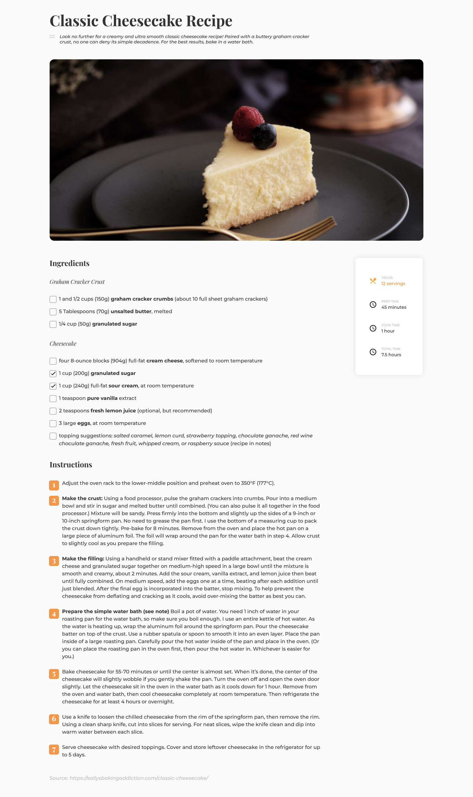

# Dev Challenges - Page 404

This is a solution to the [Recipe blog challenge on Dev Challenges](https://devchallenges.io/challenges/OEKdUZ6xs0h99C38XVht). Challenge: Create a recipe page following the given design. You can use your own recipe and remember to put the source. The page should be responsive.

Fulfill user stories below:

- User story: I can see a recipe with ingredients and instructions
- User story: I can select a checkbox if I have the ingredients
- User story: I can see the number of servings, baking times

## Table of contents

- [Overview](#overview)
  - [The challenge](#the-challenge)
  - [Screenshot](#screenshot)
  - [Links](#links)
- [My process](#my-process)
  - [Built with](#built-with)
- [Author](#author)

## Overview

### Screenshot

### Links

- Solution URL: [Repo](https://github.com/karinaestaba/recipe-page.git)
- Live Site URL: [Demo](https://karinaestaba.github.io/recipe-page)

## My process

### Built with

- Semantic HTML5 markup
- CSS custom properties
- Flexbox, CSS GRID
- Sass

## Author

- Website - [Karina Estaba]
- Dev Challenges - [@karinaestaba](https://devchallenges.io/portfolio/karinaestaba)
